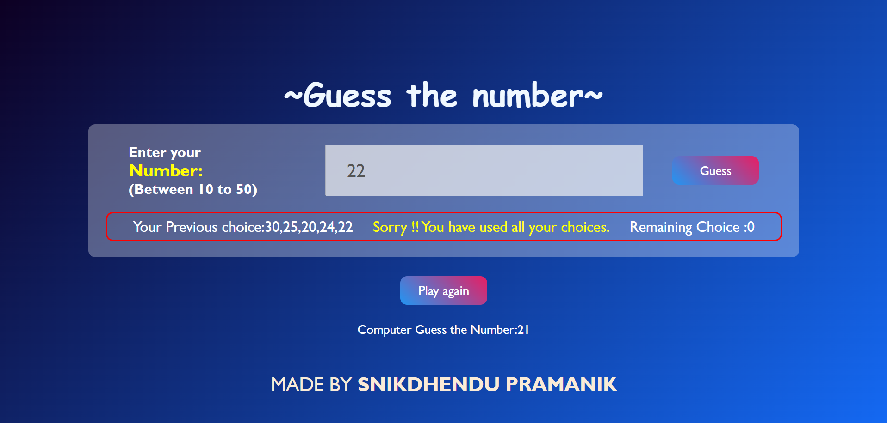

# Guess the Number Game

Welcome to the "Guess the Number" game! This simple web-based game allows users to guess a randomly generated number within a specified range.

## Game Rules

- The computer selects a random number between 10 and 50.
- The player has 5 chances to guess the correct number.
- After each guess, the player receives feedback on whether their guess is too high, too low, or correct.
- If the player guesses the correct number within the given chances, they win the game.
- If the player runs out of chances without guessing correctly, the game ends, and the correct number is revealed.

## How to Play

1. Open the [Guess the Number](#) webpage.
2. Enter your guess in the input field provided (between 10 to 50).
3. Click the "Guess" button to submit your guess.
4. Receive feedback on your guess and see your remaining chances.
5. If you guess the correct number, you win! Otherwise, try again until you run out of chances.

## Game Interface

- The game interface includes a box for entering the guess, a display of the player's previous choices, the result of the current guess, and the number of remaining chances.
- If the player wins or loses, the option to play again is available.

## Technologies Used

- HTML
- CSS
- JavaScript

## Author

Made by [SNIKDHENDU PRAMANIK](https://snikdhendu-pramanik.vercel.app/)

## Preview

Feel free to clone this repository and try the game yourself!

